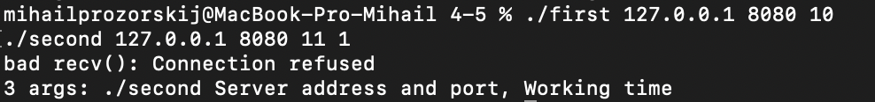
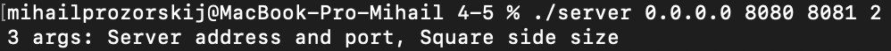
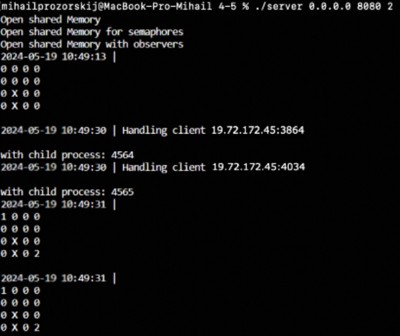
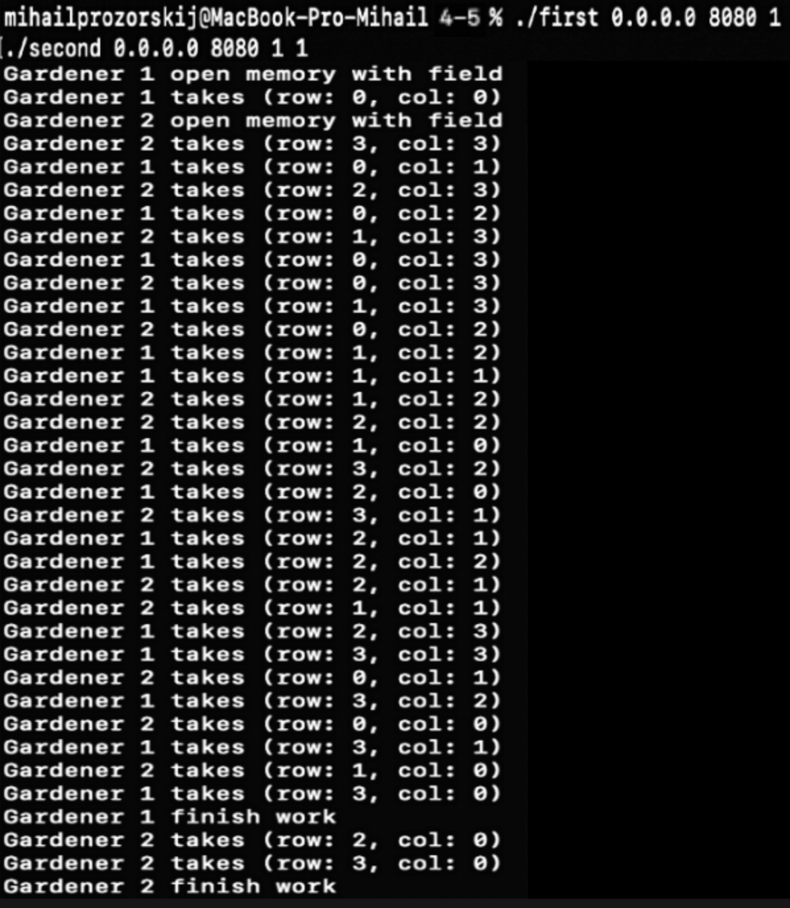

# IHW4-OS
# Прозорский Михаил Алексеевич
# БПИ224
## Вариант 21
### Условие
Задача о нелюдимых садовниках. Имеется пустой участок земли (двумерный массив размером M × N ) и план сада, разбитого на отдельные квадраты. От 10 до 30 процентов (задается случайно) площади сада заняты прудами или камнями. То есть недоступны для ухаживания. Эти квадраты располагаются на плане произвольным (случайным) образом. Ухаживание за садом выполняют два садовника, которые не хотят встречаться друг другом (то есть, одновременно появляться в одном и том же квадрате). Первый садовник начинает работу с верхнего левого угла сада и перемещается слева направо, сделав ряд, он спускается вниз и идет в обратном направлении, пропуская обработанные участки. Второй садовник начинает работу с нижнего правого угла сада и перемещается снизу вверх, сделав ряд, он перемещается влево и также идет в обратную сторону. Если садовник видит, что участок сада уже обработан другим садовником или является необрабатываемым, он идет дальше. Если по пути какой-то участок занят другим садовником, то садовник ожидает когда участок освободится, чтобы пройти дальше на доступный ему необработанный участок. Садовники должны работать одновременно со скоростями, определяемыми как параметры задачи. Прохождение через любой квадрат занимает некоторое время, которое задается константой, меньшей чем времена обработки и принимается за единицу времени.
Создать многопроцессное приложение, моделирующее работу садовников.
Каждый садовник — это отдельный процесс

### Решение
Участок земли представляет собой квадрат N*N. Если какой-то кусок участка занят препятствием, то на выводе этот участок отображается X. Каждому квадрату на участке соответствует Semaphore. Когда садовник пытается зайти на этот квадрат, он блокирует этот Semaphore, а после обработки квадратика садовник записывает в него свой номер.
Если садовнику встречаются препятствия то время прохождения равно working_time / 2.

Задание выполнялось на пять баллов.

### Требования
#### 4-5
Разработать клиент–серверное приложение, в котором сервер (или серверы) и клиенты независимо друг от друга отображают только ту информацию, которая поступает им во время обмена. То есть, отсутствует какой-либо общий вывод интегрированной информации, отображающий поведение системы в целом.
Требования:
1. В отчете необходимо привести фамилию, имя, отчество исполнителя, группу.
2. Привести номер варианта и условие задачи.
3. Представить сценарий решаемой задачи поясняющий, каким обра- зом исходные сущности и их поведение отображаются в серверы, клиенты, процессы и как осуществляется их взаимодействие.
4. При запуске программ требуемые для их работы IP адреса и порты необходимо задавать в командной строке, чтобы обеспечить гиб- кую подстройку к любой сети.
5. Для обеспечения корректного взаимодействия сетевых приложений и существующих в них процессов допускается использовать любые ранее изученные программные объекты.
6. Разработанное приложение должно работать как на одном ком- пьютере так и в распределенном (сетевом) режиме на нескольких компьютерах, по которым можно будет разнести серверы и клиен- тов.
7. Результаты работы программы должны быть отражены в отчете.
8. Завершение работы клиентов и серверов на данном этапе не оговаривается. Но оно должно быть представлено в сценарии.

### Замечание
Для запуска программ требуется ввести команду

Для сборки:
```console
make
```
Для запуска сервера на 4-5:
```console
./server SA SP size
```
Для запуска садовников:
```
./first SA SP f_speed
./second SA SP s_speed
```
где size - это длина стороны, деленная на 2. SA - server adress, SP - server port, OP - observer port. f_speed и s_speed - скорости садовников

### Реализация
#### 4-5
На сервере садовники являются отдельными потоками со своими неименованными каналами, из которых они берут задачи.
Задачи в свою очередь сервер получает от клиентов-садовников в отдельном потоке.
Оповещение системы происходит через создание Event. Созданное событие записывается в неименованный канал, откуда их читает специальный поток, который выводит в консоль сервера все события с типом MAP и SERVER_INFO
Завершение происходит через отправку сигнала SIGINT при нажатии Ctrl-C. Клиенты ожидают от сервера ответа, по истечению врнемени отправляют пакет заново. После пятой попытки работа программ-клиентов завершается.

### Тесты
так как все программы выполняют одно и тоже, решил не делить тесты на баллы

• Некорректный ввод





• Проблемы с подключением к серверу


• Корректный ввод
1. Cервер
   


3. Садовники


